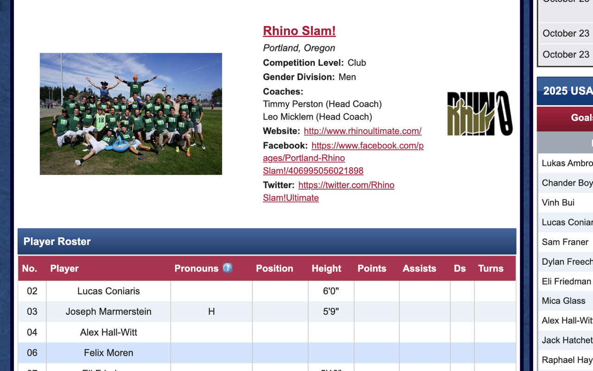
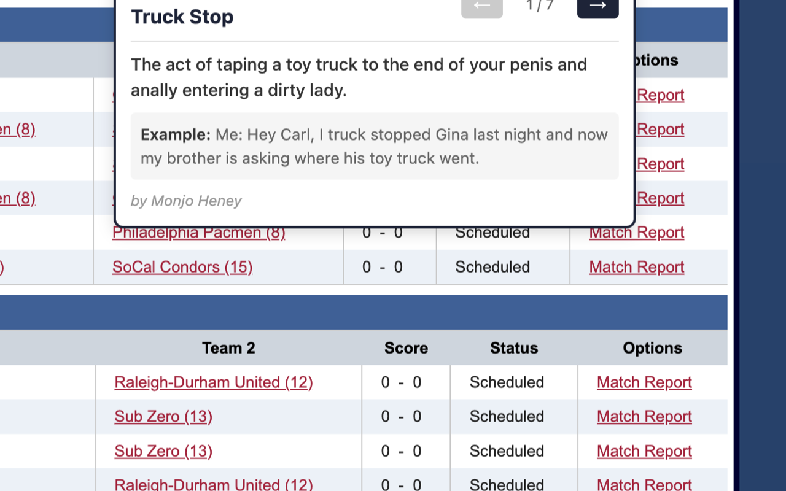
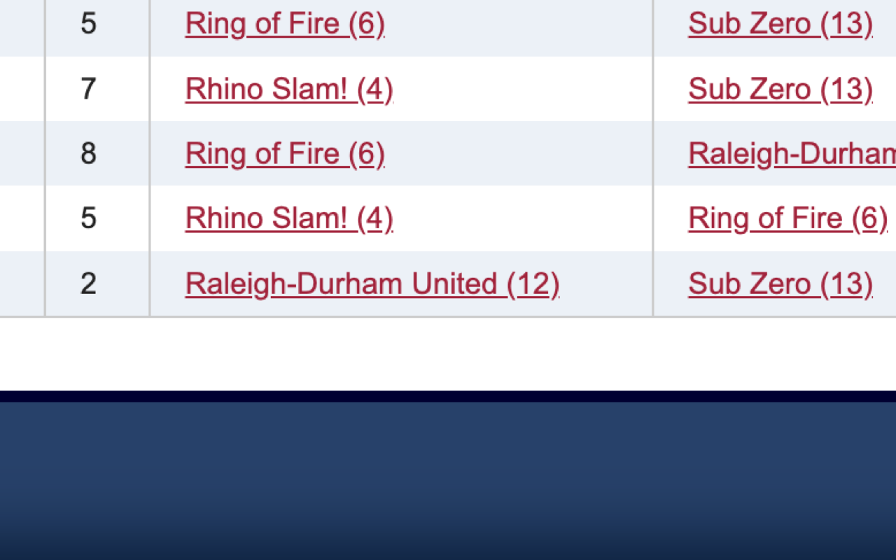

# USAU Team Name Fixer

A Chrome extension that:
1. Reverts "Rhino" back to "Rhino Slam!" throughout the USA Ultimate website
2. Adds hover cards showing Urban Dictionary definitions for all team names

## 🌐 Links

- **Website**: [usau-urban-dictionary-fix.vercel.app](https://usau-urban-dictionary-fix.vercel.app)
- **GitHub**: [github.com/hayes/usau-name-fixer](https://github.com/hayes/usau-name-fixer)

## Why?

USA Ultimate made the insane decision to forcibly change "Portland Rhino Slam!" to just "Portland Rhino" because someone complained about the Urban Dictionary definition. This extension fixes that and educates everyone about ALL team names.

## Development

```bash
# Install dependencies
pnpm install

# Start dev server with hot reload
pnpm dev
```

Then load the extension in Chrome:
1. Open `chrome://extensions/`
2. Enable "Developer mode"
3. Click "Load unpacked"
4. Select the `dist` folder

The extension will auto-reload when you make changes.

## Build for Production

```bash
pnpm build
```

## Installation

1. Clone this repository
2. Run `pnpm install`
3. Run `pnpm build`
4. Open Chrome and go to `chrome://extensions/`
5. Enable "Developer mode"
6. Click "Load unpacked"
7. Select the `dist` folder

## Screenshots

### Team Page with Full Name


### Urban Dictionary Hover Cards


### Name Restoration in Schedule


## Features

- **Automatic Name Restoration**: All instances of "Rhino" are automatically replaced with "Rhino Slam!"
- **Urban Dictionary Hover Cards**: Hover over any team name to see Urban Dictionary definitions (up to 20)
- **Pagination**: Navigate through multiple definitions with arrow buttons
- **Dynamic Updates**: Works with dynamically loaded content
- **Cached Results**: API responses are cached to minimize requests

## Deployment

The landing page is deployed to Vercel:

```bash
# Deploy to Vercel (first time)
vercel

# Deploy to production
vercel --prod
```

## Tech Stack

- TypeScript
- Vite with hot module reloading
- vite-plugin-web-extension
